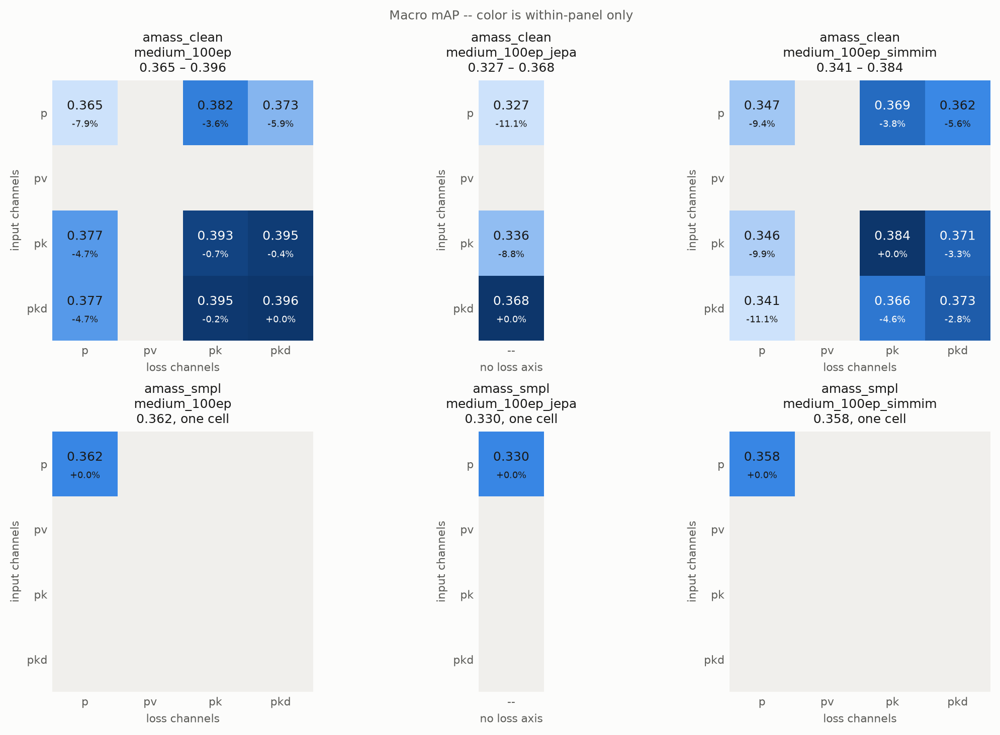
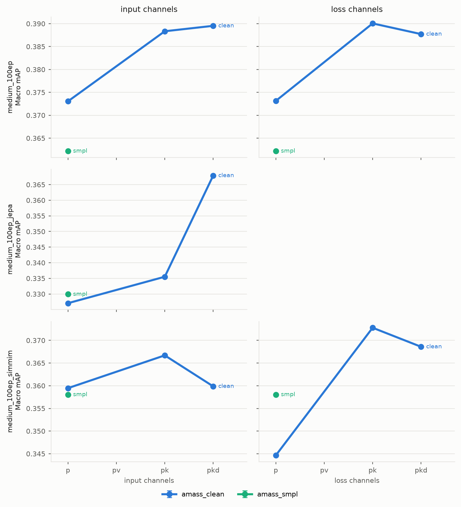
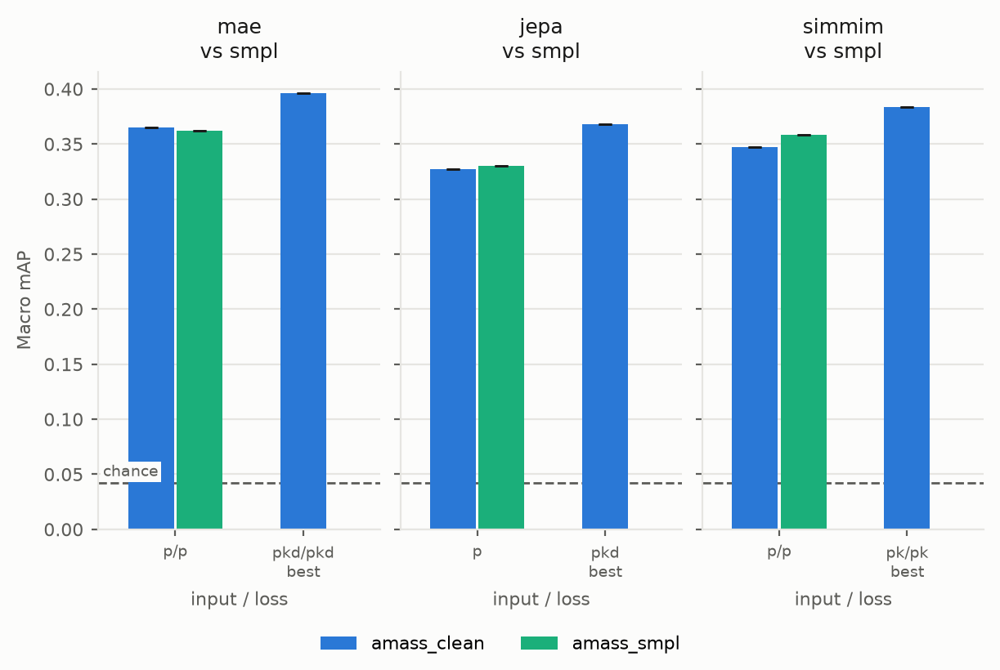
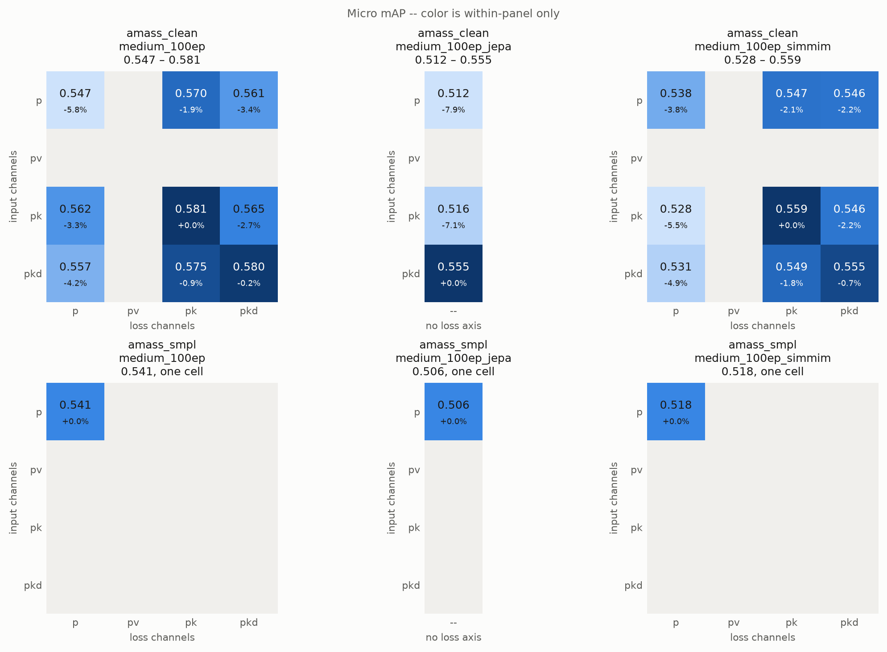
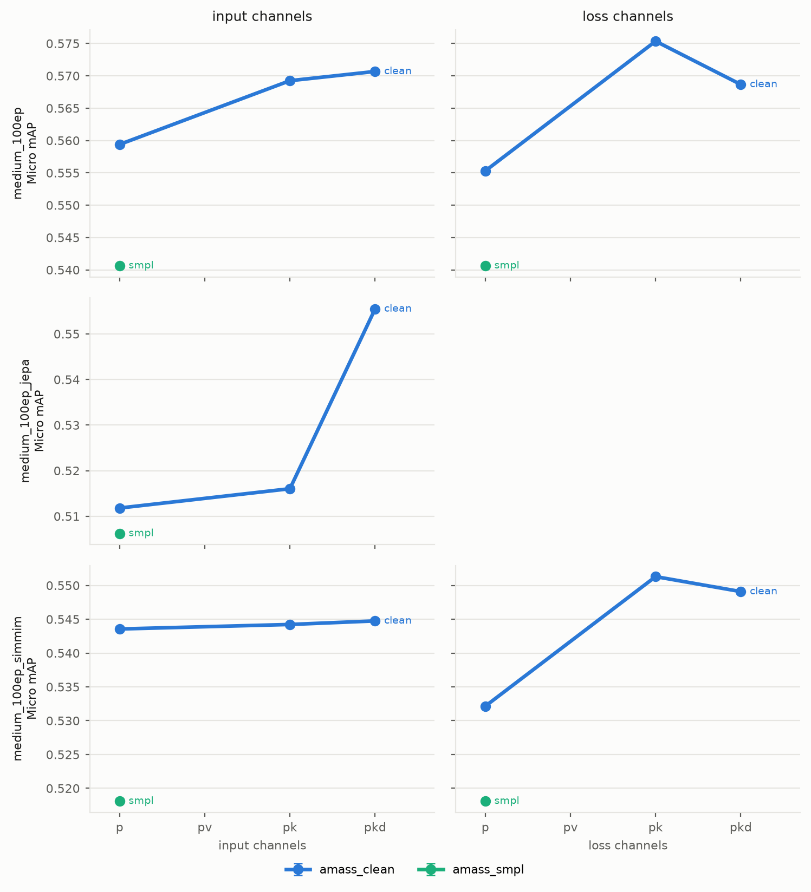
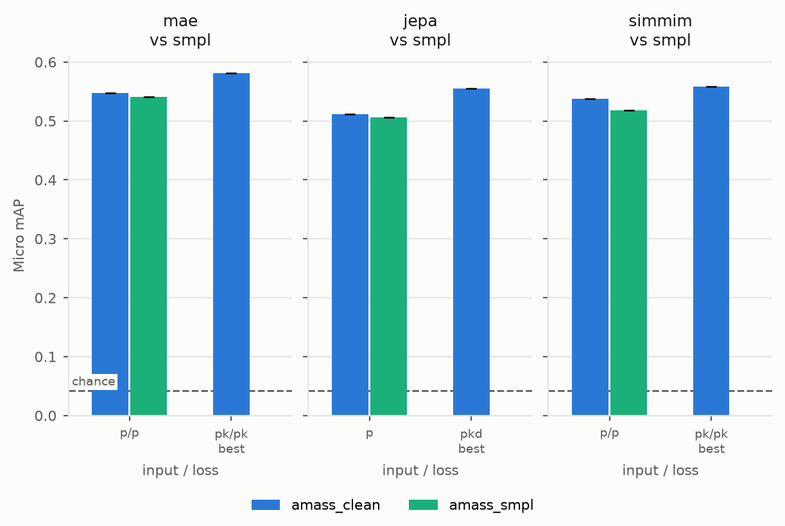

# babel_60_finetune

<!-- GENERATED by gen.py -- do not edit below this line -->

*24 cells across 2 corpora and 3 architectures. Regenerate with `gen.py`.*

*Held out of this report: `amass_motionx_clean`. The runs exist; `EXCLUDE_CORPORA` in `gen.py` is what drops them.*

*An architecture whose name carries an objective suffix (`_jepa`, `_simmim`) was pretrained with that objective; an unsuffixed one is the MAE baseline. JEPA has no reconstruction target, so its sections tabulate the input axis alone and it cannot speak to the loss-channel axis at all.*

*In the matrices, the percentage beside each cell is its relative difference from the best cell of that table: `(cell - best) / best`. It is within-table only, so it compares cells to each other and never across corpora or architectures.*

## Macro mAP

*Each matrix on its own color scale.*

*What each axis buys, per architecture.*

*Corpus against corpus, cell by cell.*

### `amass_clean` / medium_100ep (1 seed, no error bar)

| Input \ Loss | p | pv | pk | pkd |
| :--- | :---: | :---: | :---: | :---: |
| **p** | 0.3647 (-7.9%) | -- | 0.3818 (-3.6%) | 0.3726 (-5.9%) |
| **pv** | -- | -- | -- | -- |
| **pk** | 0.3773 (-4.7%) | -- | 0.3931 (-0.7%) | 0.3946 (-0.4%) |
| **pkd** | 0.3774 (-4.7%) | -- | 0.3953 (-0.2%) | **0.3960** (+0.0%) |

### `amass_clean` / medium_100ep_jepa (1 seed, no error bar, input axis only)

| Input | Macro mAP |
| :--- | :---: |
| **p** | 0.3271 (-11.1%) |
| **pv** | -- |
| **pk** | 0.3355 (-8.8%) |
| **pkd** | **0.3679** (+0.0%) |

### `amass_clean` / medium_100ep_simmim (1 seed, no error bar)

| Input \ Loss | p | pv | pk | pkd |
| :--- | :---: | :---: | :---: | :---: |
| **p** | 0.3475 (-9.4%) | -- | 0.3689 (-3.8%) | 0.3620 (-5.6%) |
| **pv** | -- | -- | -- | -- |
| **pk** | 0.3456 (-9.9%) | -- | **0.3835** (+0.0%) | 0.3710 (-3.3%) |
| **pkd** | 0.3409 (-11.1%) | -- | 0.3659 (-4.6%) | 0.3728 (-2.8%) |

### `amass_smpl` / medium_100ep (1 seed, no error bar)

| Input \ Loss | p | pv | pk | pkd |
| :--- | :---: | :---: | :---: | :---: |
| **p** | **0.3622** (+0.0%) | -- | -- | -- |
| **pv** | -- | -- | -- | -- |
| **pk** | -- | -- | -- | -- |
| **pkd** | -- | -- | -- | -- |

### `amass_smpl` / medium_100ep_jepa (1 seed, no error bar, input axis only)

| Input | Macro mAP |
| :--- | :---: |
| **p** | **0.3299** (+0.0%) |
| **pv** | -- |
| **pk** | -- |
| **pkd** | -- |

### `amass_smpl` / medium_100ep_simmim (1 seed, no error bar)

| Input \ Loss | p | pv | pk | pkd |
| :--- | :---: | :---: | :---: | :---: |
| **p** | **0.3580** (+0.0%) | -- | -- | -- |
| **pv** | -- | -- | -- | -- |
| **pk** | -- | -- | -- | -- |
| **pkd** | -- | -- | -- | -- |

### Delta, `amass_smpl` − `amass_clean` (medium_100ep)

| Input \ Loss | p | pv | pk | pkd |
| :--- | :---: | :---: | :---: | :---: |
| **p** | -0.0025 | -- | -- | -- |
| **pv** | -- | -- | -- | -- |
| **pk** | -- | -- | -- | -- |
| **pkd** | -- | -- | -- | -- |

*No replicates on either corpus, so these deltas have no error bar.*

### Delta, `amass_smpl` − `amass_clean` (medium_100ep_jepa)

| Input \ Loss | -- |
| :--- | :---: |
| **p** | +0.0029 |
| **pv** | -- |
| **pk** | -- |
| **pkd** | -- |

*No replicates on either corpus, so these deltas have no error bar.*

### Delta, `amass_smpl` − `amass_clean` (medium_100ep_simmim)

| Input \ Loss | p | pv | pk | pkd |
| :--- | :---: | :---: | :---: | :---: |
| **p** | +0.0106 | -- | -- | -- |
| **pv** | -- | -- | -- | -- |
| **pk** | -- | -- | -- | -- |
| **pkd** | -- | -- | -- | -- |

*No replicates on either corpus, so these deltas have no error bar.*

## Micro mAP

*Each matrix on its own color scale.*

*What each axis buys, per architecture.*

*Corpus against corpus, cell by cell.*

### `amass_clean` / medium_100ep (1 seed, no error bar)

| Input \ Loss | p | pv | pk | pkd |
| :--- | :---: | :---: | :---: | :---: |
| **p** | 0.5474 (-5.8%) | -- | 0.5697 (-1.9%) | 0.5611 (-3.4%) |
| **pv** | -- | -- | -- | -- |
| **pk** | 0.5619 (-3.3%) | -- | **0.5809** (+0.0%) | 0.5650 (-2.7%) |
| **pkd** | 0.5567 (-4.2%) | -- | 0.5754 (-0.9%) | 0.5799 (-0.2%) |

### `amass_clean` / medium_100ep_jepa (1 seed, no error bar, input axis only)

| Input | Micro mAP |
| :--- | :---: |
| **p** | 0.5118 (-7.9%) |
| **pv** | -- |
| **pk** | 0.5160 (-7.1%) |
| **pkd** | **0.5555** (+0.0%) |

### `amass_clean` / medium_100ep_simmim (1 seed, no error bar)

| Input \ Loss | p | pv | pk | pkd |
| :--- | :---: | :---: | :---: | :---: |
| **p** | 0.5375 (-3.8%) | -- | 0.5467 (-2.1%) | 0.5464 (-2.2%) |
| **pv** | -- | -- | -- | -- |
| **pk** | 0.5280 (-5.5%) | -- | **0.5585** (+0.0%) | 0.5461 (-2.2%) |
| **pkd** | 0.5309 (-4.9%) | -- | 0.5486 (-1.8%) | 0.5547 (-0.7%) |

### `amass_smpl` / medium_100ep (1 seed, no error bar)

| Input \ Loss | p | pv | pk | pkd |
| :--- | :---: | :---: | :---: | :---: |
| **p** | **0.5406** (+0.0%) | -- | -- | -- |
| **pv** | -- | -- | -- | -- |
| **pk** | -- | -- | -- | -- |
| **pkd** | -- | -- | -- | -- |

### `amass_smpl` / medium_100ep_jepa (1 seed, no error bar, input axis only)

| Input | Micro mAP |
| :--- | :---: |
| **p** | **0.5062** (+0.0%) |
| **pv** | -- |
| **pk** | -- |
| **pkd** | -- |

### `amass_smpl` / medium_100ep_simmim (1 seed, no error bar)

| Input \ Loss | p | pv | pk | pkd |
| :--- | :---: | :---: | :---: | :---: |
| **p** | **0.5181** (+0.0%) | -- | -- | -- |
| **pv** | -- | -- | -- | -- |
| **pk** | -- | -- | -- | -- |
| **pkd** | -- | -- | -- | -- |

### Delta, `amass_smpl` − `amass_clean` (medium_100ep)

| Input \ Loss | p | pv | pk | pkd |
| :--- | :---: | :---: | :---: | :---: |
| **p** | -0.0067 | -- | -- | -- |
| **pv** | -- | -- | -- | -- |
| **pk** | -- | -- | -- | -- |
| **pkd** | -- | -- | -- | -- |

*No replicates on either corpus, so these deltas have no error bar.*

### Delta, `amass_smpl` − `amass_clean` (medium_100ep_jepa)

| Input \ Loss | -- |
| :--- | :---: |
| **p** | -0.0056 |
| **pv** | -- |
| **pk** | -- |
| **pkd** | -- |

*No replicates on either corpus, so these deltas have no error bar.*

### Delta, `amass_smpl` − `amass_clean` (medium_100ep_simmim)

| Input \ Loss | p | pv | pk | pkd |
| :--- | :---: | :---: | :---: | :---: |
| **p** | -0.0194 | -- | -- | -- |
| **pv** | -- | -- | -- | -- |
| **pk** | -- | -- | -- | -- |
| **pkd** | -- | -- | -- | -- |

*No replicates on either corpus, so these deltas have no error bar.*

## Best cell per corpus

| corpus | arch | cell | runs | macro_map | micro_map |
| :--- | :--- | :--- | ---: | ---: | ---: |
| amass_clean | medium_100ep | `in_pkd__loss_pkd` | 1 | 0.3960 | 0.5799 |
| amass_clean | medium_100ep_jepa | `in_pkd` | 1 | 0.3679 | 0.5555 |
| amass_clean | medium_100ep_simmim | `in_pk__loss_pk` | 1 | 0.3835 | 0.5585 |
| amass_smpl | medium_100ep | `in_p__loss_p` | 1 | 0.3622 | 0.5406 |
| amass_smpl | medium_100ep_jepa | `in_p` | 1 | 0.3299 | 0.5062 |
| amass_smpl | medium_100ep_simmim | `in_p__loss_p` | 1 | 0.3580 | 0.5181 |

## Replicate spread

| corpus | arch | runs/cell | cells | sd macro_map | sd micro_map |
| :--- | :--- | ---: | ---: | ---: | ---: |

## Reference points

| baseline | Macro mAP | Micro mAP | vs best cell | protocol |
| :--- | ---: | ---: | ---: | :--- |
| chance | 0.0421 | 0.0421 | 9.41x | exact, no model |

*Best cell: 0.3960 macro mAP, taken over every architecture present, so it is the best result on the board rather than the best MAE one.*

- **chance** -- Average precision of a random ranking equals the class positive rate, so this is the mean per-class positive rate over the BABEL-60 validation windows. Computed from the annotations, so it is protocol-independent and applies to a fine-tune exactly as it does to a probe.

The probe report's other two baselines are deliberately absent. `moments` and `random encoder` are both frozen-readout numbers; a fine-tune trains the backbone, so neither is the same measurement and a dashed line would invite the comparison anyway.

## Provenance

| corpus | arch | replicates | normalization |
| :--- | :--- | :--- | :--- |
| amass_clean | medium_100ep | seed1 | `pretrain_v1_stats_train_clean.pt` |
| amass_clean | medium_100ep_jepa | seed1 | `pretrain_v1_stats_train_clean.pt` |
| amass_clean | medium_100ep_simmim | seed1 | `pretrain_v1_stats_train_clean.pt` |
| amass_smpl | medium_100ep | seed1 | `pretrain_paired_v1_train_clean.pt` |
| amass_smpl | medium_100ep_jepa | seed1 | `pretrain_paired_v1_train_clean.pt` |
| amass_smpl | medium_100ep_simmim | seed1 | `pretrain_paired_v1_train_clean.pt` |

<!-- /GENERATED -->
