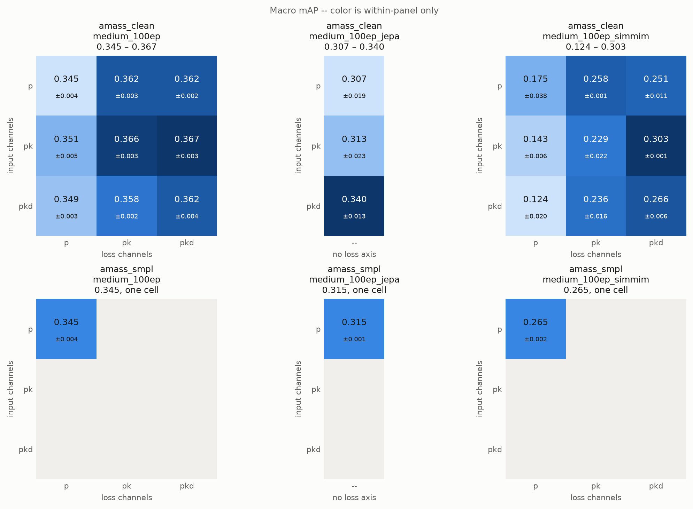
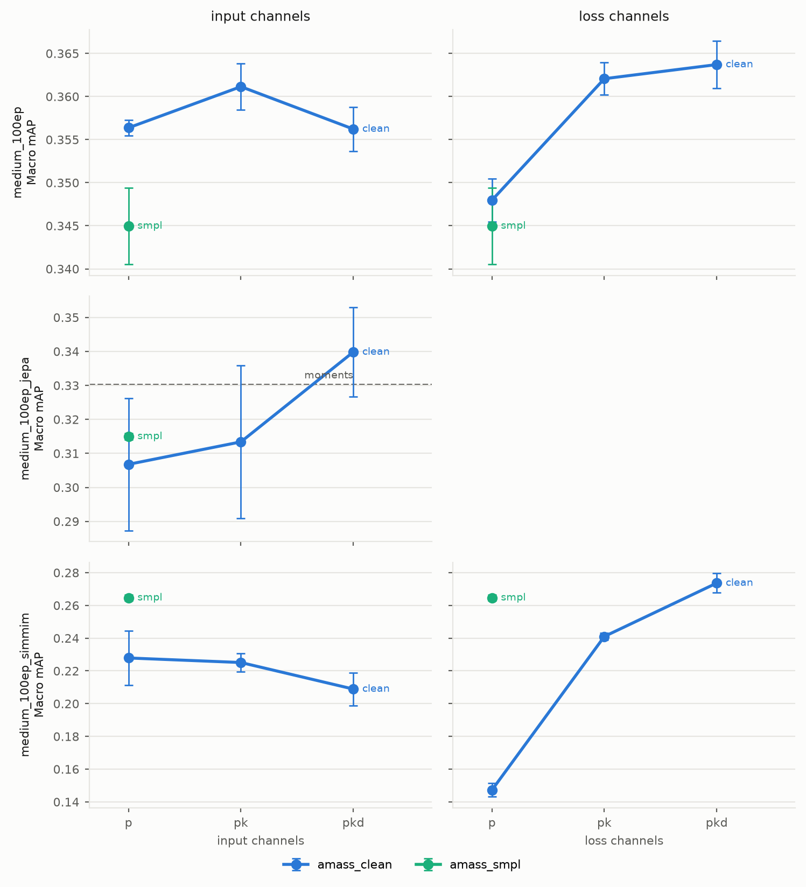
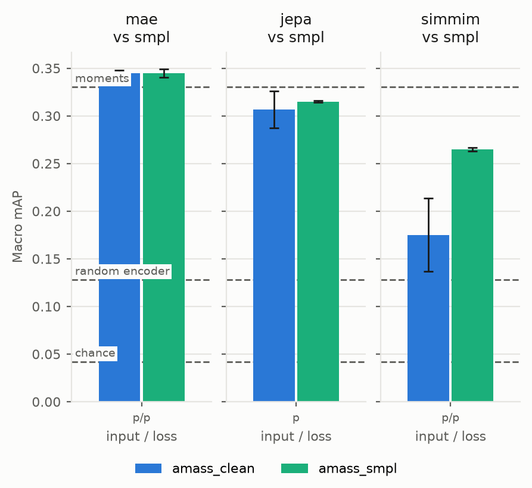
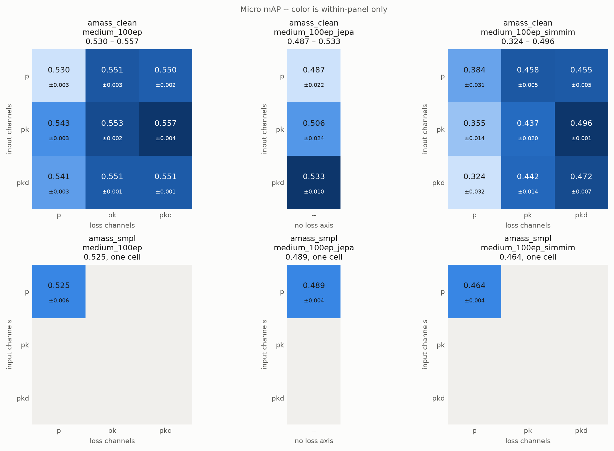
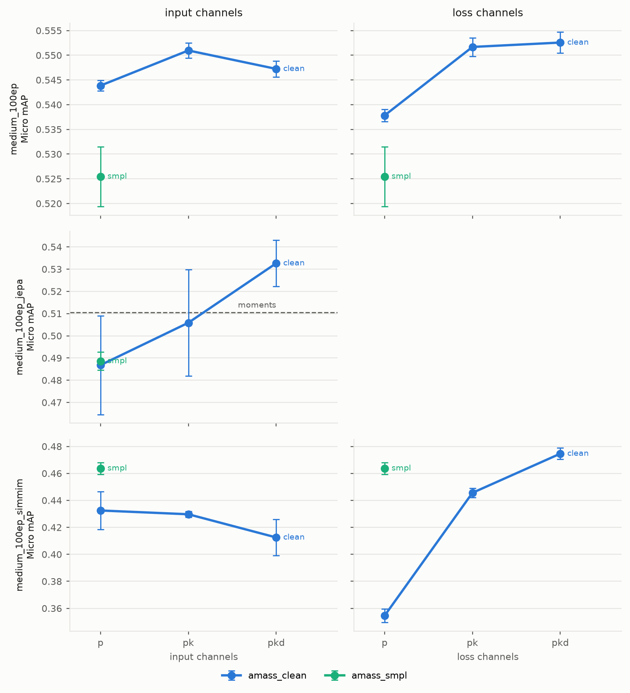
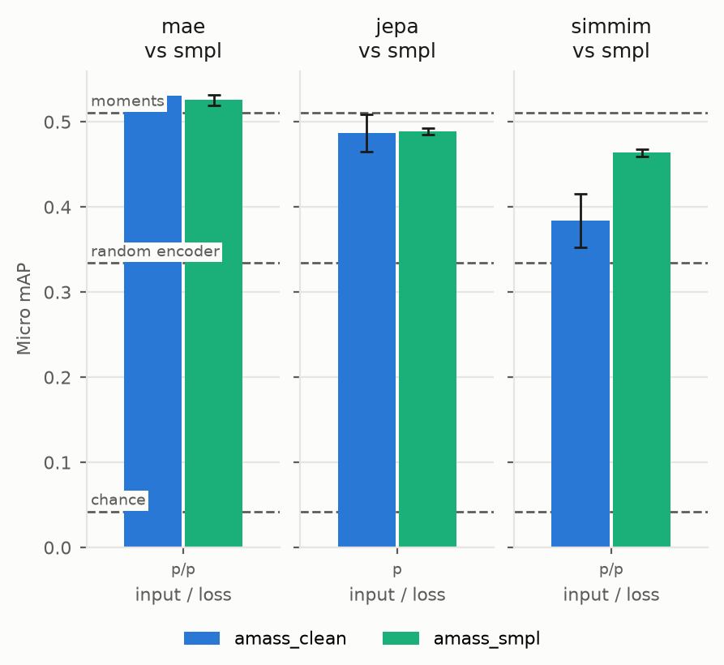

# BABEL-60 convex probe

Mean pooling plus one `Linear` head, fit to convergence with L-BFGS
(`sometria.downstream.classifier_convex.MotionConvexClassifier`). BCE over frozen pooled
features is a per-label logistic regression, so the head has one global optimum and no
learning rate, warmup, epoch budget or seed to get lucky with. The only thing selected on
validation is `weight_decay`, swept per cell over 1e-1 … 1e-6 with `train_passes=20`.

Backbones are the 3x3 `input channels x loss channels` pretraining matrix: `p` is
`sin, cos`, `pk` adds `vel, acc`, `pkd` adds `tau`. Best `epoch=*.ckpt` per cell.

Produced by `scripts/probe_matrix.sh`, read from `runs/probe/babel_60_convex/`.
Regenerate the tables below and `metrics.csv` with:

```
uv run python results/probe/babel_60_convex/gen.py
```

<!-- GENERATED by gen.py -- do not edit below this line -->

*70 cells across 2 corpora and 3 architectures. Regenerate with `gen.py`.*

*Held out of this report: `amass_motionx_clean`. The runs exist; `EXCLUDE_CORPORA` in `gen.py` is what drops them.*

*An architecture whose name carries an objective suffix (`_jepa`, `_simmim`) was pretrained with that objective; an unsuffixed one is the MAE baseline. JEPA has no reconstruction target, so its sections tabulate the input axis alone and it cannot speak to the loss-channel axis at all.*

*In the matrices, the percentage beside each cell is its relative difference from the best cell of that table: `(cell - best) / best`. It is within-table only, so it compares cells to each other and never across corpora or architectures.*

## Macro mAP



*Each matrix on its own color scale.*



*What each axis buys, per architecture.*



*Corpus against corpus, cell by cell.*

### `amass_clean` / medium_100ep (4 seeds)

| Input \ Loss | p | pk | pkd |
| :--- | :---: | :---: | :---: |
| **p** | 0.3446 ±0.0035 (-6.1%) | 0.3622 ±0.0031 (-1.3%) | 0.3622 ±0.0021 (-1.3%) |
| **pk** | 0.3505 ±0.0046 (-4.5%) | 0.3658 ±0.0029 (-0.3%) | **0.3671** ±0.0027 (+0.0%) |
| **pkd** | 0.3487 ±0.0031 (-5.0%) | 0.3581 ±0.0021 (-2.4%) | 0.3618 ±0.0039 (-1.4%) |

### `amass_clean` / medium_100ep_jepa (3 seeds, input axis only)

| Input | Macro mAP |
| :--- | :---: |
| **p** | 0.3068 ±0.0194 (-9.7%) |
| **pk** | 0.3134 ±0.0225 (-7.8%) |
| **pkd** | **0.3398** ±0.0132 (+0.0%) |

### `amass_clean` / medium_100ep_simmim (2 seeds)

| Input \ Loss | p | pk | pkd |
| :--- | :---: | :---: | :---: |
| **p** | 0.1751 ±0.0384 (-42.3%) | 0.2575 ±0.0005 (-15.1%) | 0.2510 ±0.0108 (-17.3%) |
| **pk** | 0.1426 ±0.0061 (-53.0%) | 0.2293 ±0.0220 (-24.4%) | **0.3034** ±0.0010 (+0.0%) |
| **pkd** | 0.1240 ±0.0201 (-59.1%) | 0.2362 ±0.0157 (-22.1%) | 0.2665 ±0.0059 (-12.2%) |

### `amass_smpl` / medium_100ep (3 seeds)

| Input \ Loss | p | pk | pkd |
| :--- | :---: | :---: | :---: |
| **p** | **0.3450** ±0.0044 (+0.0%) | -- | -- |
| **pk** | -- | -- | -- |
| **pkd** | -- | -- | -- |

### `amass_smpl` / medium_100ep_jepa (2 seeds, input axis only)

| Input | Macro mAP |
| :--- | :---: |
| **p** | **0.3150** ±0.0010 (+0.0%) |
| **pk** | -- |
| **pkd** | -- |

### `amass_smpl` / medium_100ep_simmim (2 seeds)

| Input \ Loss | p | pk | pkd |
| :--- | :---: | :---: | :---: |
| **p** | **0.2647** ±0.0018 (+0.0%) | -- | -- |
| **pk** | -- | -- | -- |
| **pkd** | -- | -- | -- |

### Delta, `amass_smpl` − `amass_clean` (medium_100ep)

| Input \ Loss | p | pk | pkd |
| :--- | :---: | :---: | :---: |
| **p** | +0.0003 (+0.1σ) | -- | -- |
| **pk** | -- | -- | -- |
| **pkd** | -- | -- | -- |

*Each cell reads `delta (z)`. The σ figure **is** z = delta / SE: how many standard errors of the difference the delta is, not how many seed sd's. σ = 0.0031 is the seed spread pooled over cells; with n = 4 vs 3 runs the difference of two means has SE = 0.0024, so 1σ here = 0.0024 Macro mAP. |z| > 2 is marginal (p < 0.05 for one pre-chosen cell); reading the whole 9-cell matrix and picking the largest needs |z| > 2.77 to keep the same 5% false-positive rate over the table.*

### Delta, `amass_smpl` − `amass_clean` (medium_100ep_jepa)

| Input \ Loss | -- |
| :--- | :---: |
| **p** | +0.0082 (+0.5σ) |
| **pk** | -- |
| **pkd** | -- |

*Each cell reads `delta (z)`. The σ figure **is** z = delta / SE: how many standard errors of the difference the delta is, not how many seed sd's. σ = 0.0184 is the seed spread pooled over cells; with n = 3 vs 2 runs the difference of two means has SE = 0.0168, so 1σ here = 0.0168 Macro mAP. |z| > 2 is marginal (p < 0.05 for one pre-chosen cell); reading the whole 3-cell matrix and picking the largest needs |z| > 2.39 to keep the same 5% false-positive rate over the table.*

### Delta, `amass_smpl` − `amass_clean` (medium_100ep_simmim)

| Input \ Loss | p | pk | pkd |
| :--- | :---: | :---: | :---: |
| **p** | +0.0895 (+6.7σ) | -- | -- |
| **pk** | -- | -- | -- |
| **pkd** | -- | -- | -- |

*Each cell reads `delta (z)`. The σ figure **is** z = delta / SE: how many standard errors of the difference the delta is, not how many seed sd's. σ = 0.0134 is the seed spread pooled over cells; with n = 2 vs 2 runs the difference of two means has SE = 0.0134, so 1σ here = 0.0134 Macro mAP. |z| > 2 is marginal (p < 0.05 for one pre-chosen cell); reading the whole 9-cell matrix and picking the largest needs |z| > 2.77 to keep the same 5% false-positive rate over the table.*

## Micro mAP



*Each matrix on its own color scale.*



*What each axis buys, per architecture.*



*Corpus against corpus, cell by cell.*

### `amass_clean` / medium_100ep (4 seeds)

| Input \ Loss | p | pk | pkd |
| :--- | :---: | :---: | :---: |
| **p** | 0.5303 ±0.0026 (-4.8%) | 0.5512 ±0.0033 (-1.1%) | 0.5501 ±0.0016 (-1.3%) |
| **pk** | 0.5426 ±0.0033 (-2.6%) | 0.5532 ±0.0017 (-0.7%) | **0.5571** ±0.0045 (+0.0%) |
| **pkd** | 0.5406 ±0.0034 (-3.0%) | 0.5506 ±0.0013 (-1.2%) | 0.5505 ±0.0012 (-1.2%) |

### `amass_clean` / medium_100ep_jepa (3 seeds, input axis only)

| Input | Micro mAP |
| :--- | :---: |
| **p** | 0.4868 ±0.0222 (-8.6%) |
| **pk** | 0.5059 ±0.0240 (-5.0%) |
| **pkd** | **0.5326** ±0.0105 (+0.0%) |

### `amass_clean` / medium_100ep_simmim (2 seeds)

| Input \ Loss | p | pk | pkd |
| :--- | :---: | :---: | :---: |
| **p** | 0.3842 ±0.0314 (-22.6%) | 0.4578 ±0.0052 (-7.8%) | 0.4555 ±0.0053 (-8.2%) |
| **pk** | 0.3554 ±0.0139 (-28.4%) | 0.4374 ±0.0196 (-11.9%) | **0.4964** ±0.0006 (+0.0%) |
| **pkd** | 0.3240 ±0.0324 (-34.7%) | 0.4416 ±0.0142 (-11.0%) | 0.4719 ±0.0068 (-4.9%) |

### `amass_smpl` / medium_100ep (3 seeds)

| Input \ Loss | p | pk | pkd |
| :--- | :---: | :---: | :---: |
| **p** | **0.5255** ±0.0061 (+0.0%) | -- | -- |
| **pk** | -- | -- | -- |
| **pkd** | -- | -- | -- |

### `amass_smpl` / medium_100ep_jepa (2 seeds, input axis only)

| Input | Micro mAP |
| :--- | :---: |
| **p** | **0.4886** ±0.0040 (+0.0%) |
| **pk** | -- |
| **pkd** | -- |

### `amass_smpl` / medium_100ep_simmim (2 seeds)

| Input \ Loss | p | pk | pkd |
| :--- | :---: | :---: | :---: |
| **p** | **0.4637** ±0.0044 (+0.0%) | -- | -- |
| **pk** | -- | -- | -- |
| **pkd** | -- | -- | -- |

### Delta, `amass_smpl` − `amass_clean` (medium_100ep)

| Input \ Loss | p | pk | pkd |
| :--- | :---: | :---: | :---: |
| **p** | -0.0049 (-2.5σ) | -- | -- |
| **pk** | -- | -- | -- |
| **pkd** | -- | -- | -- |

*Each cell reads `delta (z)`. The σ figure **is** z = delta / SE: how many standard errors of the difference the delta is, not how many seed sd's. σ = 0.0025 is the seed spread pooled over cells; with n = 4 vs 3 runs the difference of two means has SE = 0.0019, so 1σ here = 0.0019 Micro mAP. |z| > 2 is marginal (p < 0.05 for one pre-chosen cell); reading the whole 9-cell matrix and picking the largest needs |z| > 2.77 to keep the same 5% false-positive rate over the table.*

### Delta, `amass_smpl` − `amass_clean` (medium_100ep_jepa)

| Input \ Loss | -- |
| :--- | :---: |
| **p** | +0.0018 (+0.1σ) |
| **pk** | -- |
| **pkd** | -- |

*Each cell reads `delta (z)`. The σ figure **is** z = delta / SE: how many standard errors of the difference the delta is, not how many seed sd's. σ = 0.0189 is the seed spread pooled over cells; with n = 3 vs 2 runs the difference of two means has SE = 0.0173, so 1σ here = 0.0173 Micro mAP. |z| > 2 is marginal (p < 0.05 for one pre-chosen cell); reading the whole 3-cell matrix and picking the largest needs |z| > 2.39 to keep the same 5% false-positive rate over the table.*

### Delta, `amass_smpl` − `amass_clean` (medium_100ep_simmim)

| Input \ Loss | p | pk | pkd |
| :--- | :---: | :---: | :---: |
| **p** | +0.0795 (+5.5σ) | -- | -- |
| **pk** | -- | -- | -- |
| **pkd** | -- | -- | -- |

*Each cell reads `delta (z)`. The σ figure **is** z = delta / SE: how many standard errors of the difference the delta is, not how many seed sd's. σ = 0.0144 is the seed spread pooled over cells; with n = 2 vs 2 runs the difference of two means has SE = 0.0144, so 1σ here = 0.0144 Micro mAP. |z| > 2 is marginal (p < 0.05 for one pre-chosen cell); reading the whole 9-cell matrix and picking the largest needs |z| > 2.77 to keep the same 5% false-positive rate over the table.*

## Can the cells be ranked?

| corpus | arch | cells | range | seed σ | range / σ | noise bar | verdict |
| :--- | :--- | ---: | ---: | ---: | ---: | ---: | :--- |
| amass_clean | medium_100ep | 9 | 0.0224 | 0.0031 | 7.22 | 2.97 | **above noise** |
| amass_clean | medium_100ep_jepa | 3 | 0.0330 | 0.0184 | 1.80 | 1.69 | **above noise** |
| amass_clean | medium_100ep_simmim | 9 | 0.1794 | 0.0134 | 13.38 | 2.97 | **above noise** |

*Range across the cell means over the seed sd pooled across cells. The bar is E[range] of that many draws from pure noise -- nine identical cells still spread, so the comparison is against ~3σ, not 0. Above the bar the matrix carries structure worth ranking; below it, the best cell is a selection effect.*

## Marginal level of each axis

| corpus | arch | axis | `p` | `pk` | `pkd` |
| :--- | :--- | :--- | ---: | ---: | ---: |
| amass_clean | medium_100ep | input | 0.3564 | 0.3611 | 0.3562 |
| amass_clean | medium_100ep | loss | 0.3480 | 0.3621 | 0.3637 |
| amass_clean | medium_100ep_jepa | input | 0.3068 | 0.3134 | 0.3398 |
| amass_clean | medium_100ep_simmim | input | 0.2279 | 0.2251 | 0.2089 |
| amass_clean | medium_100ep_simmim | loss | 0.1473 | 0.2410 | 0.2736 |
| amass_smpl | medium_100ep | input | 0.3450 | -- | -- |
| amass_smpl | medium_100ep | loss | 0.3450 | -- | -- |
| amass_smpl | medium_100ep_jepa | input | 0.3150 | -- | -- |
| amass_smpl | medium_100ep_simmim | input | 0.2647 | -- | -- |
| amass_smpl | medium_100ep_simmim | loss | 0.2647 | -- | -- |

*Each value averages over the other axis. Levels only -- whether a difference between them is real is the next table.*

## Where along the ladder the gain appears

| corpus | arch | axis | `p`→`pk` | `pk`→`pkd` | total `p`→`pkd` |
| :--- | :--- | :--- | ---: | ---: | ---: |
| amass_clean | medium_100ep | input | +0.0048 (0.052) | -0.0049 (0.007) | -0.0001 (0.919) |
| amass_clean | medium_100ep | loss | +0.0141 (0.002) | +0.0016 (0.208) | +0.0157 (0.004) |
| amass_clean | medium_100ep_jepa | input | +0.0066 (0.785) | +0.0264 (0.059) | +0.0330 (0.150) |
| amass_clean | medium_100ep_simmim | input | -0.0028 (0.781) | -0.0162 (0.381) | -0.0190 (0.497) |
| amass_clean | medium_100ep_simmim | loss | +0.0938 (0.009) | +0.0326 (0.050) | +0.1264 (0.007) |
| amass_smpl | medium_100ep | input | -- | -- | -- |
| amass_smpl | medium_100ep | loss | -- | -- | -- |
| amass_smpl | medium_100ep_jepa | input | -- | -- | -- |
| amass_smpl | medium_100ep_simmim | input | -- | -- | -- |
| amass_smpl | medium_100ep_simmim | loss | -- | -- | -- |

*Paired step to the next rung, signed so positive means widening helped. Cells share a seed and seed spread is several times these effects, so each step is paired on replicate (n = 4) rather than compared as independent means. Parenthesis is the two-sided paired p; bold is significant at 0.05 Bonferroni-corrected over the 30 steps and totals shown. At three replicates a p rests on two degrees of freedom -- read direction and magnitude before decisions.*

## Best cell per corpus

| corpus | arch | cell | runs | macro_map | micro_map |
| :--- | :--- | :--- | ---: | ---: | ---: |
| amass_clean | medium_100ep | `in_pk__loss_pkd` | 4 | 0.3671 | 0.5571 |
| amass_clean | medium_100ep_jepa | `in_pkd` | 3 | 0.3398 | 0.5326 |
| amass_clean | medium_100ep_simmim | `in_pk__loss_pkd` | 2 | 0.3034 | 0.4964 |
| amass_smpl | medium_100ep | `in_p__loss_p` | 3 | 0.3450 | 0.5255 |
| amass_smpl | medium_100ep_jepa | `in_p` | 2 | 0.3150 | 0.4886 |
| amass_smpl | medium_100ep_simmim | `in_p__loss_p` | 2 | 0.2647 | 0.4637 |

## Replicate spread

| corpus | arch | runs/cell | cells | sd macro_map | sd micro_map |
| :--- | :--- | ---: | ---: | ---: | ---: |
| amass_clean | medium_100ep | 4 | 9 | 0.0031 | 0.0025 |
| amass_clean | medium_100ep_jepa | 3 | 3 | 0.0184 | 0.0189 |
| amass_clean | medium_100ep_simmim | 2 | 9 | 0.0134 | 0.0144 |
| amass_smpl | medium_100ep | 3 | 1 | 0.0044 | 0.0061 |
| amass_smpl | medium_100ep_jepa | 2 | 1 | 0.0010 | 0.0040 |
| amass_smpl | medium_100ep_simmim | 2 | 1 | 0.0018 | 0.0044 |

## Reference points

| baseline | Macro mAP | Micro mAP | vs best cell | protocol |
| :--- | ---: | ---: | ---: | :--- |
| chance | 0.0421 | 0.0421 | 8.81x | exact, no model |
| moments | 0.3303 | 0.5106 | 1.12x | matched data/labels/metrics, AdamW head |
| random encoder | 0.1280 | 0.3340 | 2.90x | NOT matched -- attentive probe, 20ep |

*Best cell: 0.3709 macro mAP, taken over every architecture present, so it is the best result on the board rather than the best MAE one.*

- **chance** -- Average precision of a random ranking equals the class positive rate, so this is the mean per-class positive rate over the 4,936 BABEL-60 validation windows (2.52 labels per window). Computed directly from the annotations, so it is protocol-independent and exact rather than measured.
- **moments** -- mean, std, min and max of every DOF x channel over the window -- 43 x 5 x 4 = 860 arithmetic numbers, no pretraining and no network -- into a linear head. Run via `scripts/moments_baseline.py --config config/experiment_linear_probe.yaml --passes 20`, so the data, label set, normalization and metrics are the probe's; only the input and the head fit differ (AdamW for 40 epochs here against the probe's convex L-BFGS). This is the baseline that says whether a probe score is *good*: the whole pretrained transformer buys +0.041 macro mAP over it, 12% relative.
- **random encoder** -- Untrained frozen backbone, from the attentive-probe era recorded in `results/loss_channels_ablation.md`. Kept as the only reference for an untrained network, but the readout differs (attentive pooling, AdamW) so it is not comparable cell-for-cell with the tables above. `probe_convex_mae.py` requires a checkpoint, so measuring this under the convex protocol needs a random-init path added first.

## Provenance

| corpus | arch | replicates | normalization |
| :--- | :--- | :--- | :--- |
| amass_clean | medium_100ep | seed1, seed2, seed3 | `pretrain_v1_stats_train_clean.pt` |
| amass_clean | medium_100ep | seed42 | `pretrain_v1_train_clean.pt` |
| amass_clean | medium_100ep_jepa | seed1, seed2, seed42 | `pretrain_v1_stats_train_clean.pt` |
| amass_clean | medium_100ep_simmim | seed1, seed42 | `pretrain_v1_stats_train_clean.pt` |
| amass_smpl | medium_100ep | seed1, seed2, seed42 | `pretrain_paired_v1_train_clean.pt` |
| amass_smpl | medium_100ep_jepa | seed1, seed42 | `pretrain_paired_v1_train_clean.pt` |
| amass_smpl | medium_100ep_simmim | seed1, seed42 | `pretrain_paired_v1_train_clean.pt` |

<!-- /GENERATED -->

## Reading

Three seeds of `amass_clean` changed the conclusions this file previously drew. What
follows is written against the replicated numbers; the single-seed version of this section
is wrong and has been removed rather than annotated.

### How large is noise

- **Seed spread is σ = 0.0025 macro mAP**, pooled over the nine cells of
  `amass_clean/medium_100ep` at three seeds. **Probe-fit spread is σ = 0.0008**, measured
  separately by re-probing one frozen backbone five times. Seed dominates by ~3x, so the
  probe is not what limits any comparison here.

- Per-cell seed spread varies **18x**, from 0.0003 (`in_p__loss_pkd`) to 0.0055
  (`in_pk__loss_p`). A single pooled σ is the right thing to test against, but it badly
  misdescribes individual cells, which is why the matrix keeps per-cell values.

### What the numbers are worth

- **The pretrained representation buys +0.041 macro mAP over arithmetic.** Best cell
  0.3714 against a moments baseline of 0.3303 -- 860 numbers (mean, std, min, max per DOF
  x channel) with no network at all. That is 16σ_seed, so it is unambiguously real, but it
  is a **12% relative** gain. Everything the corpus and channel-matrix comparisons argue
  about happens inside that 12%.

- **Scale of the whole thing:** chance 0.0421, moments 0.3303, best probe 0.3714. Most of
  the distance from chance to the probe is covered by summary statistics.

- **The architecture is probably not the limit.** In the attentive-probe measurements
  (`results/long/label_analysis.npz`) unfreezing the entire backbone moves macro AP from
  0.3778 to 0.3949 -- **+4.5%**. If capacity or inductive bias were the bottleneck, full
  gradient access to the labels should unlock far more than that. Different protocol from
  the tables above, so treat the absolute values as indicative, but the probe-to-finetune
  *gap* is measured under one protocol and is small.

- **Failures are localized, fine-grained motions.** Per class: `walk` 0.926, `sit` 0.896,
  `jump` 0.796 against `swing body part` 0.023, `waist movements` 0.083, `head movements`
  0.087. Note `human.yaml` puts all six pelvis DOFs in `excluded_dofs`, so the model never
  sees global translation or root orientation -- and `forward movement` (0.130) and
  `sideways movement` (0.329) are two of the seven classes where moments *beat* the frozen
  probe. Restoring a derived speed/heading signal is the cheapest test of that ceiling.

- **Moments beat 31 of 36 probe fits on `macro_f1s`** (0.2814 against a probe median of
  0.2579) while losing on every ranking metric. Independent confirmation that the F1
  column is measuring the operating point rather than the representation.

### What the corpus comparison shows

- **The MotionX effect largely evaporated.** Matrix-mean macro mAP went from +0.0027 to
  **+0.0010** once `amass_clean` was averaged over three seeds instead of read off seed 42.
  Seed 42 was simply an unlucky draw for that corpus.

- **No cell's corpus delta is significant.** With n = 3 against n = 1 the standard error is
  0.0029, and Bonferroni over nine cells needs |z| > 2.77. The largest observed is
  `in_pk__loss_pk` at +0.0069 (+2.4σ) -- marginal, and not after correction. Everything
  else is under 2σ.

- **Two cells moved by more than the effect being measured.** `in_pk__loss_p` shifted
  +0.0063 between seed 42 and the three-seed mean, `in_pkd__loss_p` +0.0034. The previous
  claim that "the gain lives in the `loss_p` and `loss_pk` columns" was reading seed noise
  in exactly those cells.

- **The `loss_pkd` column is the one structure that survived.** All three deltas negative
  (-0.0003, -0.0038, -0.0036), mean -0.0026. No cell is individually significant, but the
  sign is consistent, and it is the direction `results/motionx_tau_quality.md` predicts:
  MotionX's tau is noisier than AMASS's, so mixing it in should stop helping precisely when
  tau is the reconstruction target. Suggestive, not established.

- **Neither "MotionX helps" nor "MotionX does not help" is supported by this data.** The
  binding constraint is that `amass_motionx_clean` has one seed. At n = 3 vs n = 3 the
  standard error falls to 0.0020 and the observed +0.0069 would be 3.4σ -- decisive either
  way. That is the experiment to run, not more `amass_clean` seeds.

### Ranking cells

- **Rank within a seed, never across.** By absolute value the best cell is not stable:
  seed 42 and seed 1 pick `in_pk__loss_pkd`, seed 2 picks `in_p__loss_pk`. Seed spread is
  larger than the gaps between the top cells.

- **Paired, the top-cell ordering is solid** -- and this corrects an earlier claim here
  that a 0.0011 margin was a coin flip. Cells share a seed, so they should be compared
  pairwise. `in_pk__loss_pkd` beats `in_pk__loss_pk` by +0.0011, +0.0013, +0.0016 across the
  three seeds: sd 0.0002, **p = 0.010**. The effect is tiny and extremely consistent; the
  unpaired view buries it because seed spread is 20x the effect while the paired spread is
  not.

- **The wider claim still does not hold.** `in_pk__loss_pkd` over `in_p__loss_pk` is
  p = 0.229. So the result remains "the `pk`-input, wide-loss corner", with `pk`/`pkd`
  ordered above `pk`/`pk` inside it.

- **Seed sensitivity falls as the loss target widens**: mean per-cell σ is 0.0036 for
  `loss_p`, 0.0023 for `loss_pk`, 0.0016 for `loss_pkd`. Less reconstruction signal, noisier
  training. Worth knowing when budgeting replicates: the narrow-loss column needs more of
  them to say anything.

### Metrics

- **Micro mAP agrees with macro mAP almost everywhere** (Spearman +0.91 over all 36 rows,
  +0.90 and +0.88 within each corpus) and picks the same winner in both. It is tabulated
  because frequency-weighted and class-balanced are genuinely different questions on a
  frequency-ordered 60-way vocabulary -- the value is in the case where they disagree.

- **`macro_f1s` is excluded, and the reason is a confound, not noise.** It tracks the swept
  `weight_decay` at Spearman -0.710 (p < 0.0001) while macro mAP is flat against it
  (-0.033, p = 0.85). `weight_decay` scales the head's weights and therefore the logits,
  which changes how many sigmoids clear the fixed 0.5 threshold -- and it is itself selected
  per cell on macro mAP. The column substantially reports the regularization the sweep
  chose rather than the representation. Restoring it means tuning the threshold per cell
  first. Raw values stay in `metrics.csv`.

- **Recall@1/3/5 are excluded as redundant**: relative spread 4.2-5.0%, the narrowest of
  any metric, at Spearman +0.68 to +0.76 against macro mAP. Top-1 also caps near 0.33 on a
  window carrying ~3 labels, by construction.

- **`weight_decay` selects only 3e-6, 1e-5 or 3e-5** across all 36 fits, away from both ends
  of the sweep grid, so no cell is straining against its bounds.
